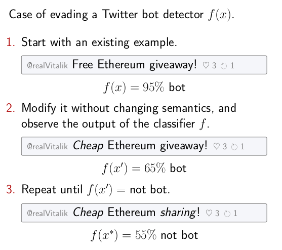
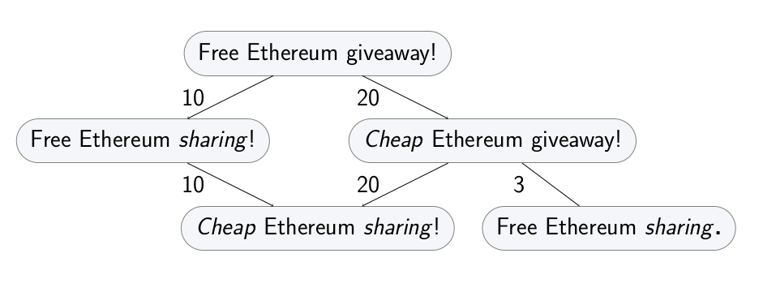

=====
Guide
=====

Intro
-----

Attacks
~~~~~~~

trickster allows to run the following kind of attack. Starting with a given correctly classified
example, apply a sequence of semantics-preserving transformations to it until the changed version of
the example causes a missclassification error. Ideally, the cost of these transformations must be
kept to a minimum.

Transformation graph
~~~~~~~~~~~~~~~~~~~~

The `capabilities` of the adversary, including the inherent constraints of the domain, can be
formalized as a `transformation graph`. Every example in the domain is a node in the graph,
and its direct descendants are some `atomic` transformations. Other transformations are sequences of
atomic transformations, so they are paths in the graph.

Each transformation can have an associated cost, representing how hard it is for the adversary
to perform it.

Running an attack is then equal to graph search: traversing this transformation graph until a
transformed example that flips the classifier decision is found.

Generic case
------------

This will show how to run a basic evasion attack for a toy Twitter bot detector.

Let's use a different feature space for a Twitter bot detector. Each example will represent an account,
and contain two features: number of tweets, and the number of likes of the account's tweets.

.. code-block:: python

    import attr

    @attr.s(auto_attribs=True)
    class TwitterAccount:
        num_own_tweets: int
        num_likes: int

Defining the transformation graph
~~~~~~~~~~~~~~~~~~~~~~~~~~~~~~~~~

The graph is defined using an ``expand_fn`` function. Given an example (a node in the graph), it returns
its atomic transformations (direct descendants in the graph) and their corresponding costs.

One possible way to define atomic transformations for numeric features like the one used in the
current example is increments and decrements. Each transformation will either increment or decrement
one of the features. It's easy to see that other transformations that change the integer values are
compositions of these.

.. code-block:: python

    def expand_fn(x):
        yield attr.evolve(x, num_own_tweets=x.num_own_tweets + 1), 1
        yield attr.evolve(x, num_own_tweets=x.num_own_tweets - 1), 1
        yield attr.evolve(x, num_likes=x.num_likes + 1), 10
        yield attr.evolve(x, num_likes=x.num_likes - 1), 1

    x = TwitterAccount(num_own_tweets=15, num_likes=5)
    for transformation, cost in expand_fn(x):
        print('Transformation: %s. Cost: %d' % (transformation, cost))

    # Transformation: TwitterAccount(num_own_tweets=16, num_likes=5). Cost: 1
    # ...

In this instantation of the ``expand_fn``, all changes have cost of one, except increasing number of
likes to own tweets. That one is more costly, since it requires more work on the adversary's side.
Any other cost model is also possible.

Defining the attack goal
~~~~~~~~~~~~~~~~~~~~~~~~

Let's first define a toy classifier.

.. code-block:: python

    def is_bot(x):
        if x.num_likes < x.num_own_tweets:
            return 'Bot!'
        else:
            return 'Not bot.'

The goal of the attack is to get a 'not bot' decision. Define it using ``goal_fn``:

.. code-block:: python

    def goal_fn(x):
        return is_bot(x) == 'Not bot.'

Hash function
~~~~~~~~~~~~~

Final technicality: examples need to be hashable. The hash function is defined as ``hash_fn``:

.. code-block:: python

    def hash_fn(x):
        return hash((x.num_likes, x.num_own_tweets)

Running the graph search attack
~~~~~~~~~~~~~~~~~~~~~~~~~~~~~~~

Having an initial example, having defined the transformation graph through ``expand_fn`` and the
adversarial goal through ``goal_fn``, you can now run a simple attack that will find an adversarial
example that incurs minimal transformation cost to the adversary:

.. code-block:: python

    from trickster.search import a_star_search

    x = TwitterAccount(num_own_tweets=15, num_likes=5)

    adv_x, cost = a_star_search(
        start_node=x,
        expand_fn=expand_fn,
        goal_fn=goal_fn,
        hash_fn=hash_fn
    )
    print('Adversarial account: %s. Cost of the attack: %d' % (adv_x, cost))

    # Adversarial account: TwitterAccount(num_own_tweets=5, num_likes=5). Cost of the attack: 10

The procedure finds a sequence of transformation that flips the decision of the classifier while
incurring the minimal possible cost to the adversary. If everything was defined correctly, the
adversary can now enact these changes to evade the detection. In this case, the adversary
needs to delete some tweets from an existing account.

This adversarial example is provably minimal, at the cost of extensive traversal of the
transformation graph. Next sections describe how to do better.

Using heuristics
----------------

The search can be sped up using heuristics. This section is coming up.

Optimal setup (:py:mod:`trickster.optim`)
-----------------------------------------

For some settings, one can find provably minimal examples even when using heuristics. This section is
coming up.
